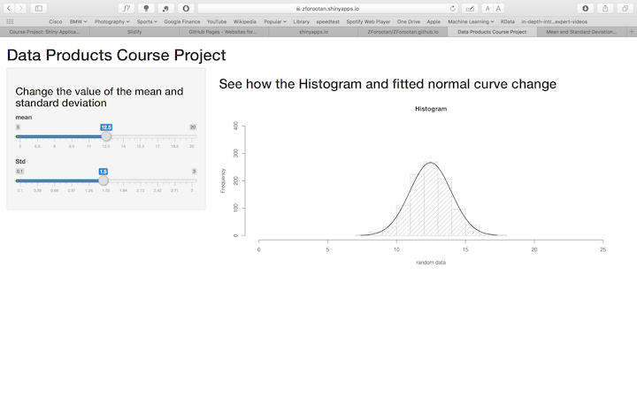

## Normal Distribution

According to Wikipedia:
- In probability theory, the normal distribution is a very common continuous probability distribution. 
- it is important in statistics and is often used in the natural and social sciences to represent real-valued random variables whose distributions are not known.

- The normal distribution is useful because of the central limit theorem. In its most general form it states that averages of random variables independently drawn from independent distributions converge in distribution to the normal, that is, become normally distributed when the number of random variables is sufficiently large.

--- .class #id 

## The mathematics of Normal Distributions

The probability density of the normal distribution is:
$$f(x \; | \; \mu, \sigma^2) = \frac{1}{\sigma\sqrt{2\pi} } \; e^{ -\frac{(x-\mu)^2}{2\sigma^2} }$$
Where:
$\mu$ is mean or expectation of the distribution (and also its median and mode).

$\sigma$ is standard deviation.

$\sigma^2$ is variance.

In R using <code>rnorm(n,mean,sd)</code>, one can produce n normally distributed points with $\mu$=mean and $\sigma$=sd. Here is an example of this code:

```r
data<-rnorm(1000,mean = 12.5,sd=1.5)
head(data)
```

```
## [1] 16.23773 12.57983 13.18437 14.86558 13.43353 14.28196
```

--- .class #id 

# Observing the effect of changes in mean and standard deviation

- As we know changing mean will move all the data points without changing their variation
- Changing Standard deviation, however, changes the dispersion of the data. 


--- .class #id

# Interactive change of mean and sd in Shiny
In my Shiny application I used the interactive sliders for mean and sd. 
Users can change the mean and sd and observe how the histogram and related normal curve changes for 1000 random data points.



.class #id
